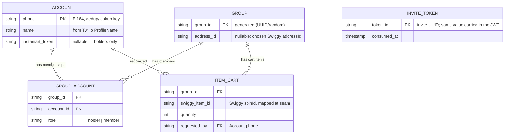

# HumaraCart — Database Design (V1)

Minimalist SQLite schema (via SQLAlchemy, per CLAUDE.md). Designed collaboratively;
this file is the living record. Sections marked **OPEN** or **PENDING** are not yet
settled.

---

## Scope — what we persist (and what we don't)

We store only the **household-layer state the backend must remember between
messages**. The **cart itself is NOT stored** — it lives on Swiggy and is fetched
via `get_cart`. We persist the things Swiggy doesn't know about: who's in a
household, their roles, and (per group) which address it orders to.

Identity/state split:
- **Identity** → `Account` (per person)
- **Group membership + role** → `GroupAccount` (per person-in-group)
- **Group-level state** → `Group`
- **Durable cart** → `ItemCart` (per item-in-a-group's-cart)
- **Invite single-use** → `InviteToken` (consumed-token ledger)

---

## Entities (5)



`Account` ↔ `Group` is **many-to-many**, resolved by the `GroupAccount` join table.

---

## 1. `Account` — a person (a HumaraCart account, NOT a Swiggy account)

Everyone is an `Account` — the account holder *and* every invited member. "Account"
means an account **at our end**; the holder is simply the one who *also* linked Swiggy.

| Column | Type | Notes |
|---|---|---|
| `phone` | string (E.164) | **PK.** The dedup/lookup key. Strip Twilio's `whatsapp:` prefix. |
| `name` | string | Captured automatically from Twilio `ProfileName` on the first inbound message. |
| `instamart_access_token` | string, **nullable** | Holder's Swiggy bearer. `NULL` for members. Person-level (reused across every group they hold), never duplicated onto `Group`/`GroupAccount`. |
| `token_expires_at` | timestamp, **nullable** | When the access token lapses (~5 days). |
| `instamart_refresh_token` | string, **nullable** | For auto-refresh. **Caveat below** — may not be issued yet. |

**Rules:**
- **One `Account` per person, deduplicated by `phone`.** Joining/switching groups
  **never** creates a new `Account` — only a new `GroupAccount` row.
- Join logic: inbound message → look up `Account` by phone → reuse if exists, else
  create once → then add/find the `GroupAccount` row.
- Data captured via invite link needs no prompting: `phone` (from `From`) + `name`
  (from `ProfileName`) both arrive in the first WhatsApp message.

**Token refresh — DECIDED: design for refresh (auto-refresh).** Store
`instamart_refresh_token`; on expiry, refresh the access token instead of making the
holder re-consent.
- **⚠️ Caveat (verify at build):** our live token exchange returned **no
  `refresh_token`** (keys: `access_token, token_type, expires_in, user_id, tid`),
  even though the AS advertises the `refresh_token` grant. So we must confirm a
  refresh token can actually be obtained — possibly via an `offline_access`-style
  scope/param, or it may be **not issued yet**. If unavailable, the same fields fall
  back to **re-consent** (leave `instamart_refresh_token` `NULL`).

**Security — DECIDED: encrypt at rest (from V1).** These are real bearer credentials
to users' live Instamart accounts — plaintext-at-rest is a corner we won't cut, even
in a demo (and this is a Builders Club submission judged partly on security).
- **Field-level encryption** on the token columns: encrypt on write / decrypt on read
  inside `AccountDAO`, symmetric (Fernet, `cryptography` lib).
- **Encryption key from an environment variable** — never in the DB or code
  (CLAUDE.md: secrets from env). A leaked SQLite file yields unusable ciphertext.
- Columns are unchanged (strings holding ciphertext). Never logged.
- Effort: ~half a day (dependency + encrypt/decrypt helper + DAO wiring).

---

## 2. `GroupAccount` — the join (relationship between `Group` and `Account`)

One row = **one person, in one group, with their role there.**

| Column | Type | Notes |
|---|---|---|
| `group_id` | FK → `Group.group_id` | which group |
| `account_id` | FK → `Account.phone` | which person (holder *or* member) |
| `role` | enum: `holder` \| `member` | that person's role **in this group** |

**Constraint:** `(group_id, account_id)` **unique** — a person is in a group at most once.

**Why role lives here (not on `Account`):** the same person can be `holder` in one
group and `member` in another (the edge case). Role is a property of the
*(person, group)* pairing, so it belongs on the membership row.

**Role — write path (set at onboarding, by which path the person came in):**
- `holder` ← person completes **Swiggy OAuth** and a group is created for them.
  (Can't hold a group without a linked account to build the cart.)
- `member` ← person taps a valid **invite link** and joins an existing group.
  No Swiggy auth involved.

```
Priya:  OAuth success → creates G1 → GroupAccount(G1, Priya, holder)
Rahul:  taps invite   → joins  G1 → GroupAccount(G1, Rahul, member)
Rahul:  OAuth success → creates G2 → GroupAccount(G2, Rahul, holder)
```

**Role — read path:** the holder of a group = the `GroupAccount` row for that
`group_id` where `role = 'holder'`. To act on a group's cart:
```
1. GroupAccount: group_id = G AND role = 'holder'  → holder's account_id
2. Account:      phone = <that>                     → instamart_token
3. use that token for G's MCP calls
```

**Critical distinction:** *"has a token"* (an `Account` fact) is **not** the same as
*"is the holder of this group"* (a `GroupAccount` fact). Always identify the holder
by `role`, never by token presence — Rahul has a token but is a `member` in G1.

---

## 3. `Group` — a household group

`group_id` (PK) + minimal group-level state.

| Column | Type | Notes |
|---|---|---|
| `group_id` | string | **PK.** Generated (UUID/random) — nothing natural to key on. |
| `address_id` | string, **nullable** | Chosen Swiggy delivery address id (one of the holder's saved addresses). Set at setup when the holder picks; `NULL` until then. Required by `search_products` + `update_cart` + `checkout`. |

**Address selection is a required, holder-driven step (Swiggy agent guidance).** At
onboarding the bot calls `get_addresses`, **STOPs, shows the list, and asks the holder
which address to use** — Swiggy mandates this (*"Do NOT call any other tool until the user
has selected an address … Remember the selected addressId for all subsequent
operations"*). We store that id here and reuse it everywhere; we **never** auto-pick the
cart's default `selectedAddress` (verified live: the default can be an unintended saved
address). Since **carts are per-address**, this pin is what keeps the household on one
shared cart — and the holder's Swiggy app must be on this same address or it shows an
empty cart. If `get_addresses` is empty, onboarding asks the holder to add one — in the
Instamart app or via the `create_address` MCP tool (it exists; V1 use is a YAGNI call).
See `REFERENCE.md`.

Deliberately **absent** (all derivable / redundant):
- **No `holder` column** — derivable from `GroupAccount` (`role = 'holder'`).
- **No group name** — "Priya's household" is derivable from the holder's `Account.name`.
- **No cached address text** — `get_addresses` stays the source of truth; re-fetch the
  human-readable line on the rare occasions we need to display it.

---

## 4. `ItemCart` — the durable cart (item-set + quantity + who)

The **local source of truth** for a group's cart. Swiggy's cart is ephemeral (short
TTL — below), so we hold the intended items here and (re)build Swiggy's cart from
these rows. We store only what's needed to rebuild + attribute — **not** price or
product name (those come live from `get_cart`).

| Column | Type | Notes |
|---|---|---|
| `group_id` | FK → `Group` | which group's cart |
| `swiggy_item_id` | string | Swiggy's `spinId`, mapped at the `InstamartClient` seam |
| `quantity` | int | needed to build the full-replace `update_cart` payload |
| `requested_by` | FK → `Account.phone` | the member who asked for it (powers the duplicate-catch) |

Key: **`(group_id, swiggy_item_id)`** — an item appears once per group's cart.

**Local = source of truth; Swiggy's cart is a rebuildable materialization:**
- **The agent calls MCP directly, but the deterministic guard owns the `update_cart`
  payload:** the agent *drives* the decision (what to add/remove); the guard builds the
  full local item-set from these rows (+ the agent's delta) and sends that — never a
  payload hand-crafted by the LLM, so a full-replace can't wipe items.
- `update_cart` is **full-replace**, and we always send the **full local item-set**
  built from these rows (never from `get_cart`) → a silently-expired Swiggy cart
  **self-heals** on the next write.
- `get_cart` is used only for **display + stock/price reconciliation** (annotate local
  items with live price/availability; flag out-of-stock), never to decide *what* is in
  the cart.
- **Cart TTL:** Swiggy carts expire (short-lived, not days; exact TTL undocumented).
  The explicit `CART_EXPIRED` error is **planned, not yet emitted** — so we do **not**
  depend on catching it; full-replace-from-local makes expiry a non-issue. We also
  refresh (full-replace from local) when the holder signals they're ready to check out
  (`ready to order`), so the cart is fresh at order placement.

**Lifecycle (local ↔ Swiggy in lockstep):**
- **add** → upsert local row → `update_cart(full local set)`
- **remove** → delete local row → `update_cart(full set)`; if it was the last item → `clear_cart`
- **order placed** → the agent calls `checkout`; on success, delete the group's local
  rows (cart consumed). Belt-and-suspenders: a placed order also shows in `get_orders`.

**Ordering & payment — the agent places the order; we store no payment data:**
- On the holder's **explicit confirmation**, the agent calls `checkout` to place a
  **real order**. Payment methods come from `get_payment_options` (UPI apps + QR + Cash
  on delivery); the holder picks one (presented as a WhatsApp text list). We do **not**
  choose or touch payment internals, and store **no** payment data — Swiggy owns payment.
- **No `Order` table** — Swiggy owns orders (`get_orders` / `track_order`); we keep no
  order records of our own.
- `checkout` constraints we honor: multi-store → separate order per store, cart
  `< ₹1,000` cap, ALWAYS explicit holder confirmation. (Fully **unattended** auto-order —
  no per-order confirmation — is deferred to V3.)

**`brand` — dropped (decided).** Derivable from `swiggy_item_id` and already present in
`get_cart`'s product name, so we don't store it (same reason as the address text).
Future brand *preferences* ("change milk to Mother Dairy") are a separate V2 concept at
group/account level, not an `ItemCart` column.

---

## 5. `InviteToken` — single-use invite ledger

Enforces that each JWT invite is used **once**. The JWT is self-validating (signed;
carries `group_id` + expiry + `token_id`), so signature/expiry/group checks are
**stateless** — this ledger exists **only** to catch replays.

| Column | Type | Notes |
|---|---|---|
| `token_id` | string (UUID) | **PK.** The invite's unique id — the same value carried in the JWT. |
| `consumed_at` | timestamp | when it was used (housekeeping) |

**Flow (on join):** decode + verify JWT → read `token_id` →
- already in the ledger → **reject** (replay / already used);
- not present → accept, add the member (`GroupAccount` row), **insert `token_id`**.

Dedicated table (not a `GroupAccount` column) so single-use survives a member
leaving/rejoining — a deleted membership row can't erase the used-token record.
`group_id` isn't stored here (it's in the JWT); add it only if we later want invite
visibility/revocation (not needed for V1).

---

## Key nuances (design decisions locked)

- **"Account" = our-side account, not Swiggy's.** Members have no Swiggy account;
  they still get an `Account` row (that's how we know who joined).
- **Identity by phone, token by person, role by membership** — three distinct levels,
  each in its own place. Don't collapse them.
- **Reuse, never recreate:** a returning person keeps their single `Account` and
  accumulates `GroupAccount` rows over time.
- **Edge case supported structurally:** person as holder in one group + member in
  another = one `Account`, multiple `GroupAccount` rows. No special-casing needed.

---

## Deferred (out of V1)

- **Multi-household message routing.** If one phone belongs to *several* groups, an
  inbound "add milk" is ambiguous (which group's cart?). Handling it needs an
  "active group" / switch mechanism. **Deferred** — V1 assumes **one phone = one
  group** in practice, even though the schema *allows* more (so we're not painted
  into a corner).

---

## Design status — COMPLETE

**Schema complete — 5 tables:** `Account`, `Group`, `GroupAccount`, `ItemCart`,
`InviteToken`. All design decisions closed (token refresh + encrypt-at-rest, cart
local-as-truth, roles on the join, dedup-by-phone, single-use ledger).

**Verify at build time** (runtime unknowns, not design gaps):
- Whether a `refresh_token` can actually be obtained (live test returned none — see §1);
  if not, the same fields fall back to re-consent.
- The inner `data` field names for `get_cart` (parse defensively on first real call).
