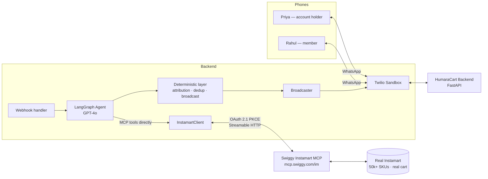

# HumaraCart — Implementation Plan (V1 Demo)

> Scope of this document: the **V1 recorded demo** for the Swiggy Builders Club —
> a working, real-MCP-integrated household cart on localhost. Not the production
> rollout (see [Path to Production](#12-path-to-production)).

---

## 1. Goal

Record a demo of HumaraCart working end to end: two flatmates, on real WhatsApp,
co-build **one shared Instamart cart** via natural-language messages to an AI
agent that drives **Swiggy's real Instamart MCP** — ending in a **real order
placed** (on the holder's confirmation) on the account holder's Instamart account.

**This is a recorded demo, not a live one.** The reliability bar is "one clean
take"; retakes are free. That shapes several decisions below.

---

## 2. What's In / Out for V1

**In**
- Real WhatsApp channel (Twilio Sandbox), 2 members
- **Real Swiggy Instamart MCP** integration on localhost (real tools, real data)
- Real OAuth (this is the account holder's "link Instamart" step)
- **JWT invite flow** — account holder generates a signed, single-use, expiring
  invite link; members join the household by tapping it
- LLM-driven agent that understands messy natural language and drives MCP tools
- Household coordination: shared cart, duplicate-catch, attribution, broadcast
- **SQLite** persistence — household + `requested_by` attribution (the cart itself
  lives on Swiggy) — per-entity DAOs behind `IDAO`; schema in `DB_DESIGN.md`
- **Docker** packaging (reproducible setup now, easy deploy later)

**Out (deferred, not needed for the story)**
- Postgres / Redis (SQLite covers V1), LangSmith, order tracking UI
- Brand disambiguation as a *separate* step — folded into variant selection (the holder picks from the shown search results, which already span brands)
- V2 intelligence (reorder reminders); V3 **unattended** auto-order (V1 checkout
  always asks the holder to confirm)
- **In-chat new-address creation** (`create_address`) → **V2.** V1 uses an *existing* saved
  address; if the holder lacks it, they add it in the Swiggy app once, then onboard.
  (Creating over WhatsApp needs a shared **location pin** for lat/long + address parsing —
  supportable, just not demo-critical.)

> **V1 boundary — ordering & payment:** the agent places the order **in WhatsApp** via MCP
> `checkout` — no app-handoff. Guardrails (Swiggy's own): **explicit holder confirmation**,
> cart **< ₹1000**, delivery address stated back first. Payment options come from
> **`get_payment_options`** (UPI apps + QR + COD), shown as a **text list**; the holder
> picks. **Online UPI is verified in-channel** — `checkout(paymentMethod="UPI")` returns a
> relayable `bridgeUrl` the agent sends over WhatsApp; the holder taps → pays → the order
> auto-finalizes. **COD** also works in chat.
>
> The **only** time the app is used: a cart **≥ ₹1000**, where Swiggy *blocks* in-chat
> `checkout` and mandates the app — a forced fallback we honor, not a user choice. We
> **never handle or store** payment details — Swiggy owns the payment step end to end.

---

## 3. Key Decisions (locked)

| Decision | Choice | Why |
|---|---|---|
| MCP backend | **Real Swiggy Instamart MCP**, localhost | Swiggy allows free localhost prototyping against real tools; no mock can match a real checkout-able cart |
| Agent | **LLM-driven, calls MCP tools directly** — custom LangGraph `StateGraph` (tool-calling **loop** + `interrupt` for human-in-the-loop + deterministic **write-guard**); swappable `ChatOpenAI` | Matches the agentic pitch; Swiggy supports LangGraph; raw MCP results (out-of-stock, etc.) must be interpreted → a loop, not single-shot |
| LLM | **OpenAI GPT-4o** via LangChain `ChatOpenAI` | Model-swappable (GPT-5 later) with no call-site changes |
| Channel | **Twilio Sandbox for WhatsApp**, 2 Androids | Real WhatsApp is the core of the pitch |
| Household layer | **Ours** — `CartService` wraps the MCP client | MCP has no notion of "who added what" or "broadcast" |
| Auth | **OAuth 2.1 PKCE + Dynamic Client Registration** | No manual client_id; self-registers; localhost redirect allowed |
| In-process mock | **Test double only** | Fast offline unit tests without network/login |
| Persistence | **SQLite** (V1) via SQLAlchemy, per-entity DAOs behind `IDAO` | Backend is a connection-URL detail — Postgres later is a config change. Full schema: `DB_DESIGN.md` |
| Packaging | **Docker** (+ compose) | Reproducible setup now; near-trivial deploy later (DigitalOcean) |
| Concurrency | **Sync `def`, no async** — fast-ack webhook + background task | FastAPI threadpools `def`; async's benefit is irrelevant at this scale. Twilio's ~15s webhook timeout + broadcasting to both phones both need processing off the request path |
| Cart sync | **Write-through** — push to Instamart on every add/remove | "Add to cart and forget"; the cart is always checkout-ready. Local SQLite list is the source of truth; the per-household read-modify-write is serialized (`update_cart` is full-replace) |
| Order placement | Agent places the order **in-chat** via `checkout` (UPI or COD), on explicit confirmation, cart `< ₹1000`. Cart `≥ ₹1000` → Swiggy-forced app fallback only (not a user choice) | Completes the story end to end in WhatsApp while honoring Swiggy's >₹1000 restriction; payment via `get_payment_options` — **online UPI verified in-channel** (real order placed; agent relays the `bridgeUrl`); we store no payment data |

All decisions locked — including tool layering (see [§7](#7-the-agent)).

---

## 4. Architecture



**Layering, top to bottom**
1. **WhatsApp / Twilio** — receive member messages, send replies + broadcasts.
2. **LangGraph agent (GPT-4o)** — understand the message and **call the MCP tools
   directly** (`search_products`, `update_cart`, `get_cart`, `get_payment_options`,
   `checkout`). **No household wrapper tools** — the agent drives Swiggy's MCP itself.
3. **Deterministic layer (ours)** — **not** tools the agent calls; it wraps the agent's
   MCP interaction to guarantee the invariants: **attribution** (changed item → the
   *message sender*, resolved in plain Python from the WhatsApp `From`), **dedup**, and
   **broadcast** after a cart change. (This is where `CartService`'s tested logic lives.)
4. **`InstamartClient`** (concrete) — the real client the agent's MCP calls go through →
   Swiggy Instamart MCP.

**Boundary that matters:** everything above the client is written against the
`IInstamartClient` interface; the concrete `InstamartClient` is the only thing that
touches Swiggy. Demo and production differ only in that client's endpoint + token.
*(Naming: `IInstamartClient` = interface, `InstamartClient` = real impl,
`MockInstamartClient` = test double.)*

**Request flow (fast-ack + background, all sync):** the webhook handler does almost
nothing — validate the Twilio request, hand the work to a **background task**, and
return `200` immediately (Twilio expects a reply within ~15s). The background task
runs the agent (calling the MCP tools directly, write-through to the cart) with the
deterministic layer doing attribution / dedup / broadcast, then sends the reply *and* the
broadcast via Twilio's **REST API** (one webhook response can't reach the other member). Everything is **sync `def`** — FastAPI threadpools it; no async, no
`await`, in the codebase.

---

## 5. The Swiggy MCP Integration

> **Confirmed real (verified live end to end).** The demo runs against **real**
> Instamart catalog + cart data — verified via `/im` on a real account:
> `get_addresses` returned the account's real saved addresses, `search_products`
> returned real SKUs at real prices with real `spinId`s, and `update_cart`/`get_cart`
> drive a real, checkout-able cart. `checkout` places a **real order** (real delivery,
> real payment) — **not** sandboxed or staging-gated. **Online UPI payment is verified
> in-channel:** a live `checkout(paymentMethod="UPI")` returned a relayable `bridgeUrl`, the
> holder paid, and the order finalized — so it is **not COD-only** (see `REFERENCE.md` →
> "Online payment (UPI)"). Localhost prototyping hits real production data; no approval is
> needed until scale. **Every tool, including `checkout`, is now exercised live.**

- **Server:** `POST mcp.swiggy.com/im` — Streamable HTTP — 13 documented Instamart tools (+ live `get_payment_options`, and live-only `check_payment_status` / `confirm_order`).
  **⚠️ Use `/im`, NOT `/instamart`.** `/im` accepts the token and works end-to-end;
  `/instamart` rejects it ("Incorrect alg in MCP JWT") — they are **not**
  interchangeable. Also: the server is **stateless** (no `Mcp-Session-Id` header
  returned), and it accepts the token as-issued (`iss: ozone-cx`, `aud: null` —
  those don't matter). Verified live end-to-end against a real account.
- **Tools we use:**

  | Tool | Params | Returns | Used for |
  |---|---|---|---|
  | `get_addresses` | — (session auth) | saved addresses, no lat/long | resolve `addressId` (needed by search) |
  | `search_products` | `addressId`, `query`, `offset?` | variants with `spinId` + pricing | resolve "milk" → a product |
  | `update_cart` | `selectedAddressId`, `items[{spinId, quantity}]` | updated cart | **replaces the whole cart** (see below) |
  | `get_cart` | — (session auth) | cart contents + bill | dedup check + broadcast + summary |
  | `get_payment_options` | — (session auth) | UPI apps + QR + COD | payment picker, shown before `checkout` |
  | `checkout` | `addressId`, `paymentMethod?` | placed order | **places the order** — on explicit confirmation, cart `< ₹1000` |
  | `track_order` | `orderId` | ETA + status | (deferred) |

- **Response envelope (all tools):** `{ "success": true, "data": {…}, "message": "…" }`
  or `{ "success": false, "error": { "message": "…" } }`. `InstamartClient`
  unwraps this uniformly. The inner `data` field names (exact price keys, cart-item
  shape) are **not published** — we parse them defensively at runtime on the first
  real call.
- **⚠️ `update_cart` is a full-cart replace, not incremental.** There is no
  add/remove `action`; you send the entire desired item list. So add/remove is a
  **read-modify-write from our local `ItemCart` table (the source of truth)**:
  mutate local → send the **full local item-set** to `update_cart`. We do **not**
  read `get_cart` to decide contents — Swiggy's cart is ephemeral (short TTL, can
  expire), so re-sending the full local set every time **self-heals** expiry.
  `get_cart` is used only for display + stock/price reconciliation. `CartService`'s
  add/remove interface is unchanged — the seam absorbs the mismatch.
- **Data mapping:** our `Product` ⇄ Swiggy `spinId` + name + price; `addressId`
  fetched once via `get_addresses` and reused. `requested_by` is keyed by
  `swiggy_item_id` in `ItemCart` (Swiggy's cart doesn't track it).
- **Verified response shapes (live):** `get_addresses` → `result.structuredContent.addresses[]`
  (`id`, `addressLine`, `addressTag`); `search_products` → `result.content[0].text` is a
  **JSON string** → parse → `data.products[].variations[].spinId` + `.price.{mrp,offerPrice}`.
  Tool results wrap payloads in `result.content[].text` (+ sometimes `structuredContent`).
- **Swiggy guidance we honor:** cart is authoritative server-side → call
  `get_cart` at turn boundaries rather than trusting agent memory; `checkout` is
  non-idempotent → verify via `get_orders` on 5xx before retry.
- **Error handling (from the errors reference).** All failures share the envelope
  `{ success:false, error:{ message, reportLink?, reportHint? } }`. Client policy:
  - **Auth** — `401` / JSON-RPC `-32001` → re-run OAuth (token/session dead).
  - **Bad input** — `400` with `Invalid…/Missing…` → fix args, **no retry**.
  - **Upstream** — `502`/`503`, or `504`/`timeout` → exponential backoff + jitter
    (500ms → 8s), **max 5 retries**.
  - **Domain** — HTTP `200` with `success:false` → surface the message to the
    user, terminal (no retry).
  - **Internal** — `500` / `-32603` → back off once, then escalate via `report_error`.
  - Planned codes (not yet emitted): `UNAUTHENTICATED`, `TOKEN_EXPIRED`,
    `SESSION_REVOKED` (419), `INSUFFICIENT_SCOPE` (403), `CART_EXPIRED`. We do
    **not** depend on catching `CART_EXPIRED` — expiry self-heals because every
    `update_cart` re-sends the full local item-set (see §5 cart note).

### Auth flow (once, by the account holder)
```
1. Generate PKCE (code_verifier, code_challenge S256)
2. Browser → GET  mcp.swiggy.com/auth/authorize?...&scope=mcp:tools
             (Swiggy login + consent)
3. Redirect → http://localhost/callback?code=...
4. POST mcp.swiggy.com/auth/token  (code + code_verifier) → bearer token
5. Cache token; refresh via refresh_token grant (advertised — verify at step 2)
```
Client registration is automatic via **DCR** (`POST /auth/register`). This
consent *is* HumaraCart's "link your Instamart account" onboarding step — real,
not stubbed.

**Verified first-hand** (live curl + `.well-known/oauth-authorization-server`,
not paraphrase):
- Both `mcp.swiggy.com/instamart` and `/im` are live and **require auth** (401 +
  `WWW-Authenticate: Bearer`) — corrects an earlier claim that the MCP layer was
  "currently unauthenticated."
- Authoritative endpoints: `authorization_endpoint` `/auth/authorize`,
  `token_endpoint` `/auth/token`, `registration_endpoint` `/auth/register`,
  `code_challenge_methods` `S256` (PKCE ✓), `scopes` `mcp:tools`,
  `grant_types` include `refresh_token` (✓ — corrects earlier "no refresh"),
  `token_endpoint_auth_methods` include `none` (public client OK).
- **DCR tested working:** `POST /auth/register` → `201 Created`, returns a
  **fixed public `client_id` = `swiggy-mcp`** (no secret; PKCE only) and accepts
  a `http://localhost:8765/callback` redirect. → step 1 is optional; just use
  `client_id=swiggy-mcp`.
- **PKCE tested:** the `openssl` verifier/challenge (S256, 43-char) generate
  correctly. Server CORS confirms header names `Mcp-Session-Id`,
  `mcp-protocol-version`.
- **⇒ The entire auth flow up to the browser consent is proven.** Only the
  post-login half remains: token exchange + `get_addresses`/`search_products`,
  which needs a one-time human login (run the curl runbook by hand). That single
  run also settles the last open question — real vs sandbox **data**.

---

## 6. The Household Layer (ours)

The genuinely-HumaraCart IP that the MCP does not provide:

- **Member ↔ household mapping** — inbound `From` phone → member → household. Members
  join via the **JWT invite flow**: the account holder generates a signed,
  single-use, expiring link (encoding household ID + expiry); tapping it opens
  WhatsApp and the bot validates the token and adds the member. Single-use is
  enforced by tracking consumed token IDs. (The account holder's household is
  created on first contact.)
- **Household delivery address** — chosen **once at onboarding** from `get_addresses`
  (Swiggy *requires* the holder to pick; we never auto-select the cart's default), stored
  as `Group.address_id` and reused for every `search`/`update`/`checkout`. Since carts are
  **per-address**, this pin is what keeps the whole household on one shared cart — and why
  the holder's Swiggy app must be on the same address, or it shows an empty cart.
- **Duplicate detection** — the **deterministic layer, wrapping the agent's `update_cart`**, checks the current cart; if the `spinId` is already there it surfaces *"already on the list (added by Priya)"* from the attribution ledger. **The money shot** — guaranteed in code, not left to the agent.
- **Attribution** — `ItemCart.requested_by`: which member requested each item (keyed by `swiggy_item_id`). **Set from the message sender** (`From` → member, plain Python — no diff, no LLM) after each cart change. Powers the duplicate-catch. See `DB_DESIGN.md`.
- **Broadcast** — after any cart change, push the updated list to **both** phones. Deterministic (never an LLM decision).
- **Source of truth — `ItemCart` (SQLite) stays local-as-truth (DECIDED).** The agent **drives** the decision (what to add/remove), but the **deterministic guard constructs the actual `update_cart` payload from the full local `ItemCart` set (+ the agent's delta)** — so a full-replace can never wipe items, and re-sending the full local set **self-heals** Swiggy-cart expiry. Attribution (new item → the **sender**) is recorded in `ItemCart` at the same point. The per-household write is **serialized** (`update_cart` is full-replace).

**`CartService`'s role in the direct-MCP model:** it is **no longer called by tools**
(there are none). It becomes the **deterministic guard the graph runs around the agent's
cart-changing MCP calls** — it **constructs the safe full-replace `update_cart` payload from
the local set** (so the agent's decision can't wipe items), records **attribution** (by
sender), detects **duplicates**, formats the list, and triggers the **broadcast**. So the
agent **drives** the write; the guard **guarantees** it. Its **interface changes** from
`add_item`/`remove_item` to this guard surface (exact shape at build). **The 19 existing
tests** cover the dedup + attribution + full-replace-from-local logic, which **survives** —
so they get **refactored** onto the new interface, not discarded.

---

## 7. The Agent

- **Framework:** a **custom LangGraph `StateGraph`** — a **tool-calling loop** (the agent
  calls an MCP tool, **observes the result, and re-reasons** before the next tool or reply),
  **plus `interrupt`** for the ask-and-wait turns (variant / checkout-confirm / address),
  **plus the deterministic guard on writes**. *Not* the vanilla prebuilt agent — we need the
  interrupts + guard. GPT-4o via swappable `ChatOpenAI`, `temperature=0`.
- **Why a loop, not single-shot:** raw MCP results must be *interpreted before acting* —
  out-of-stock, not-serviceable, no-match, min-order, cart-cap (see scenarios). The agent
  can't pick the next step without seeing the previous tool's result.
- **Job:** parse messy natural language (multi-item, quantities, negation, Hinglish, typos)
  → drive the MCP tools → **handle the "world says no" conditions gracefully** (scenarios
  below) → compose short, WhatsApp-style replies.
- **Variant selection — ASK (Swiggy-mandated).** `search_products` guidance requires the
  agent to *"ask the user which specific variant they want before adding to cart."* So: if
  the request gives a size/qty (*"1L milk"*), match it deterministically; if it doesn't
  (*"add milk"*), **ask which variant** — never auto-pick (a blind first-pick lands on a
  combo, e.g. VS Mani 2×60g). *(Brand choice falls out of the same pick — the shown search
  results span brands, so there's no separate brand-disambiguation step.)*
- **System prompt (to design next):** persona, "ask which variant when size unspecified,"
  "confirm concisely," "one item per line in lists," guardrails against off-task actions.

### Scenarios the agent must handle (living list — expand during system-prompt design)

Each needs the agent to **observe a tool result and re-reason** (hence the loop).
**Non-exhaustive — more will surface; keep adding.**

| Scenario | Signal | Agent response |
|---|---|---|
| Out of stock (at add time) | `isInStockAndAvailable: false` | don't add; tell user / offer an in-stock alternative |
| Out of stock (discovered at checkout) | re-checked at `ready to order` / `checkout` | flag out-of-stock items before showing the order summary — a cart can sit for days, so stock is checked again, not just trusted from add-time |
| Not serviceable at the address | no serviceable result / `ADDRESS_NOT_SERVICEABLE` | explain it can't be delivered here |
| No match | `search_products` returns nothing | say so; ask for a different term |
| Ambiguous / multiple variants | many results, no size given | **ask which variant** (Swiggy-mandated) |
| Duplicate add | `spinId` already in cart | *"already on the list — added by Priya"* (money shot) |
| Remove an item not in the cart | not in `ItemCart` | *"that's not on the list"* |
| Quantity change | *"make it 3", "2 more"* | update quantity via the guard |
| Min order not met | `MIN_ORDER_NOT_MET` (< ₹99) | prompt to add more |
| Cart ≥ ₹1000 | checkout RESTRICTION | route to the Swiggy app |
| Payment fails / times out | `check_payment_status` → FAILED/TIMEOUT | tell user; offer a fresh `bridgeUrl` |
| MCP tool error (5xx / timeout) | error envelope | retry w/ backoff; if it persists, apologise + `report_error` |
| Auth/token expired mid-session | `401` / `-32001` | re-run OAuth |
| Off-topic / out-of-scope message | — | politely stay on task |
| Unknown sender (not onboarded) | `From` not in any household | prompt to join / onboard |
| Invite token expired or reused | `InviteToken` consumed/expired | tell them to request a fresh link |
| Multi-store cart | checkout splits per store | inform: "items from N stores → N orders" |
| Holder's wanted address not saved | not in `get_addresses` | **V1:** add it in the Swiggy app; in-chat `create_address` = **V2** |

These shape the **system prompt** and the graph's **error-handling edges** — not an afterthought.

### Tool layering — **DECIDED: agent calls MCP directly**
The agent binds the **Swiggy MCP tools directly** (`search_products`, `update_cart`,
`get_cart`, `get_payment_options`, `checkout`) via `InstamartClient`. **There are no
household wrapper tools** (`add_item` etc.) — the agent drives the MCP itself; that's the
agentic core, and the real MCP calls show in the tool-call log.

- **Correctness is a deterministic layer, not a wrapper tool.** The invariants —
  **attribution** (changed item → the **message sender**, resolved in plain Python from the
  WhatsApp `From`), **dedup**, and **broadcast** — run in deterministic code that **wraps**
  the agent's MCP interaction (in the graph, around tool execution), *not* inside tools the
  agent calls.
- **Attribution needs no diff and no LLM:** we always know who sent the message
  (`From` → member), so the sender *is* the "who."
- **Trade-off accepted:** more agentic than wrapping; the deterministic layer still keeps
  the money-shot (dedup + "added by Priya") reliable without the agent owning correctness.

### M5 build decisions (settled in discussion — do not re-litigate)

1. **Human-in-the-loop = `interrupt`, never the prompt.** Anywhere the flow must stop and
   wait for a person, it stops via LangGraph `interrupt` — a runtime halt the model cannot
   skip — *not* by instructing the model to ask a question. Structural, not behavioural.
   This supersedes the "ask which variant" bullet above being a prompt-only rule.
   - **Exactly two interrupt points inside the graph: variant pick, and payment-mode /
     checkout confirm.**
   - **Address selection stays OUTSIDE the graph** — already built deterministically in M4's
     `OnboardingService` (holder links Instamart → `get_addresses` → replies with a number →
     `Group.address_id`). One-time setup; the address never changes afterwards, so the agent
     would never need to ask. Not worth dragging into the graph for uniformity.
   - **Quantity gets no interrupt.** "add milk" defaults to 1, "add 2 milk" is already
     explicit; no realistic demo phrasing needs the stop, and each extra interrupt is another
     beat in the recording.
   - **The interrupt lives in its own node, never in the `tools` node.** `interrupt()` must be
     called inside a node (edges are pure routing and cannot pause), and on resume **the whole
     node re-executes from the top** — so anything above the `interrupt()` call runs twice.
     Keeping the ask in a dedicated do-nothing node means resuming never re-issues the Swiggy
     search that produced the options, and never re-runs a checkout. The **conditional edge**
     decides whether we need to ask; the **node** does the asking.

   **Graph shape — 3 nodes:**

   ```
                             START
                               │
                               ▼
           ┌───────────────► agent ───────────────► END
           │                 │   │                (no tool call — just a reply)
           │      tool call  │   │  checkout — confirm first
           │                 ▼   │
           │              tools  │
           │              │   │  │
           │       done   │   │  │  result needs a choice
           └──────────────┘   ▼  ▼
                           ask_human      ← interrupt() lives here
                               │
                               └──────────► (back to agent)
   ```

   | From | Condition | To |
   |---|---|---|
   | `START` | always | `agent` |
   | `agent` | no tool call | `END` |
   | `agent` | tool call, no confirmation needed | `tools` |
   | `agent` | tool call is `checkout`, not yet confirmed | `ask_human` |
   | `tools` | result needs a human choice (multiple variants) | `ask_human` |
   | `tools` | otherwise | `agent` |
   | `ask_human` | after resume | `agent` |

   **Asymmetry to remember:** variants are asked *after* the tool runs (search produced the
   options); checkout is asked *before* (you can't confirm an order by placing it first).

   **Loop hazard:** because `ask_human` always returns to `agent`, the LLM re-issues the
   `checkout` call after confirmation — so state must carry a "already confirmed" flag, or the
   edge routes back to `ask_human` forever.
2. **`update_cart` keeps Swiggy's name; the model passes only the one item.** The guard
   composes the full-replace payload. A full item list must never be composed by the model —
   one omission silently deletes a flatmate's groceries. (Resolves the contradiction between
   "no wrapper tools like `add_item`" here and "guard builds the payload + the agent's delta"
   in §6: the *name* stays Swiggy's, the *payload* stays the guard's.)
3. **Payload base is always local `ItemCart`, never `get_cart`.** Swiggy's cart is
   per-address (verified live), `clear_cart` rotates the cartId (verified), and expiry is not
   distinguishable (`CART_EXPIRED` is planned but not emitted). Any of these returns an empty
   cart while the household still has items — basing a full-replace on that wipes the list.
   `get_cart` is for **display and stock/price reconciliation only**.
4. **Injected parameters are invisible to the model.** `address_id`, `group_id` and
   `requested_by` come from graph state, never from tool arguments — so the model sees
   `search_products(query)`, not `search_products(address_id, query)`, and cannot write into
   another household's cart.
5. **One thread per household** (`thread_id = group_id`), so flatmates share one conversation
   history. Inbound messages are therefore **speaker-labelled** ("Priya: add milk") — without
   it the agent blurs who asked for what and attribution in replies goes to the wrong person.
6. **Reply vs broadcast.** Cart actually changed → **deterministic** message, identical to
   everyone including the sender (agent does not compose it). No cart change (duplicate,
   variant question, error, "show list") → agent prose, **sender only**. Matches the demo
   script, and keeps broadcast fully out of the LLM's hands.
7. **Runaway loops** are bounded by an explicit `recursion_limit` on invoke; `GraphRecursionError`
   is caught and answered with a graceful "I got stuck, try rephrasing".
8. **`interrupt` requires a checkpointer.** `MemorySaver` loses paused conversations on
   restart, which is bad mid-recording — so a SQLite checkpointer package must be added
   (not currently installed) and pointed at the DB file we already mount.
9. **Scope discipline: this is a recorded MVP demo.** Retakes are free. Do not build for
   failure modes the demo will never hit.
10. **LangSmith** — decision deliberately deferred to the *end* of M5, when prompt iteration
    is what's actually happening.

---

## 8. Tech Stack

| Layer | Choice |
|---|---|
| Backend | Python, FastAPI |
| Concurrency | Sync `def` handlers (FastAPI threadpool); fast-ack webhook + background task — **no async** |
| Agent | LangGraph **custom `StateGraph`** — tool-calling loop + `interrupt` (human-in-the-loop) + deterministic write-guard; sync `.invoke`; swappable `ChatOpenAI` (GPT-4o) |
| MCP client | Streamable HTTP → `mcp.swiggy.com/im` (stateless; token as-issued) |
| Persistence | SQLite via SQLAlchemy, per-entity DAOs behind `IDAO` (Postgres later = URL change); schema `DB_DESIGN.md` |
| Messaging | Twilio Sandbox for WhatsApp |
| Packaging | Docker + docker-compose (SQLite file on a mounted volume) |
| Local exposure | ngrok / cloudflared (tunnel Twilio webhook → the published port) |
| Tests | **pytest** (runs the existing `unittest` cases as-is + new pytest-style tests); dedicated test container |

---

## 9. Build Sequence (riskiest-first)

External dependencies are where demos lose time, so we prove them early. **Both are now
proven live — see `VERIFICATION.md`.**

| # | Step | Proves | Status |
|---|---|---|---|
| 0 | Core `CartService` + tests | Household logic is solid | ✅ done (aside) |
| 1 | Twilio round-trip | "send a WhatsApp → get a reply" on real phones | ✅ **done** — round-trip **+ broadcast to 2nd phone** proven (`verify_twilio.py`) |
| 2 | MCP client + OAuth vs real Instamart | We can search + update a real cart from localhost | ✅ **dependency proven** (`verify_swiggy.py` — real order placed); the `InstamartClient` class still to build |
| 3 | Rewire `CartService` → `InstamartClient` | Household logic works on real data | pending |
| 4 | LangGraph agent binding MCP tools directly | NL → MCP tool calls → cart | pending |
| 5 | Broadcast + glue in the webhook | Both phones stay in sync | 🟡 broadcast **mechanism proven** (`verify_twilio.py`); webhook glue pending |
| 5b | JWT invite / onboarding flow | Account holder invites → member joins the household | pending |
| 6 | Tool-call logging for the recording | The "under the hood" shot | pending |
| 7 | Dry-run the locked script end to end | Demo is recordable | pending |

**Estimated ~8–10 focused build-days (≈2 weeks solo)** for the full frozen
scope — real MCP client + OAuth, JWT invite/onboarding flow, SQLite/DAO, Docker,
pytest + test container, agent + system prompt, background-task write-through, plus
an end-to-end dry run. (The JWT invite flow now in V1 adds ~0.5–1d.) Recording is
separate (~0.5d). Step 0 (core engine) is done. See the breakdown in
the response that accompanied this plan.

---

## 10. Reliability Strategy (recorded demo)

- `temperature=0`, tight system prompt, small tool set → predictable behavior.
- Correctness-critical logic (dedup, attribution, broadcast) lives in **tested code**, not the model.
- `get_cart` at turn boundaries (Swiggy's own guidance).
- Retakes are free — no live failure risk.
- Pre-flight before recording: OAuth token fresh (<5 days), both phones joined to the Twilio sandbox, `get_addresses` returns a valid `addressId`.

---

## 11. Demo Script (locked)

Household: **Priya** (account holder) + **Rahul**. Both phones mirrored via
scrcpy, side by side, single screen recording, plus a terminal showing the tool
calls fire.

**Onboarding (shown on camera):**
1. Priya messages the bot → bot sends the "link your Instamart" OAuth link → Priya authorizes → bot calls `get_addresses`, **shows her saved addresses and asks which to use for the household** (Swiggy's required address-selection step) → Priya picks one → *"Instamart linked ✓. Delivering to <address>. Household created."* (stored as `Group.address_id`, reused for every cart op).
2. Priya: `invite` → bot returns a **signed, single-use invite link** → Priya forwards it to Rahul.
3. Rahul taps the link → WhatsApp opens → bot validates the token → *"Welcome to HumaraCart, powered by Swiggy Instamart. You've joined Priya's household — orders are fulfilled via Priya's Instamart; you don't need one."*

**Core loop (the heart):**
4. Priya: `add milk` → both phones: *added + current list*
5. Rahul: `add detergent` → both: *updated list*
6. Rahul: `add milk` → *"already on the list (added by Priya)"* ← **money shot**
7. Priya: `add chips` → both: *updated list*
8. Rahul: `remove detergent` → both: *updated list*
9. Rahul: `show list` → *current list*

**Close (order placed on camera):**
10. Rahul: `ready to order` → Priya: *"Rahul thinks the cart's ready…"*
11. Priya: `checkout` → bot shows the **full bill** (items + `get_cart` billBreakdown:
    item total, fees, delivery, grand total `< ₹1000`) + **delivery address**, and lists
    **payment options** (UPI apps / QR / Cash on delivery).
12. Priya picks **UPI** → bot calls `checkout(paymentMethod="UPI")` and sends the **full
    payment link** (`bridgeUrl`) → Priya taps, pays in her UPI app → the order
    **auto-finalizes** → *"Instamart order placed successfully"* (Swiggy's message, as-is).
    Both phones see it. *(COD is also available; the order is placed entirely in WhatsApp.)*

Add one "impressive NL" message (e.g. *"we're out of milk, grab 2 chips"*) to
show the agent handling real phrasing.

**Variant handling in the demo:** the agent must **ask which variant** when a size isn't
given (Swiggy-mandated — see §7). To keep the core-loop beats one-shot, members **state the
size** (*"add 1L milk"*, *"add 1 pack chips"*), so items resolve directly; show the
**ask-which-variant** on exactly one item (a bare *"add chips"* → *"which one?"*) to
demonstrate the mandated flow without slowing every add.

**Recording note:** the OAuth step (beat 1) shows Priya's real Swiggy login —
trim or blur the login screen in post and keep the *"linked ✓"* result on camera
(privacy). Likewise, don't linger on the raw invite-link JWT.

---

## 12. Path to Production

Because the demo already uses the real MCP, the gap is small:
- Swap the OAuth redirect/localhost for the production callback; obtain production credentials via Swiggy's review (submit the demo video).
- Add the deferred layers as they're needed: Postgres/Redis, LangSmith, order-tracking broadcast, V2 reorder intelligence.
- Nothing above the `IInstamartClient` seam changes.

---

## 13. Open Items

1. ~~Tool-layering sign-off~~ — **DECIDED:** the agent calls the **MCP tools directly** (no `add_item` wrapper); a deterministic layer wraps them for attribution (by sender) + dedup + broadcast (§7).
2. ~~Pull exact Instamart tool schemas~~ — **MOSTLY RESOLVED:** input contracts confirmed
   (§5), incl. the `update_cart` full-replace behavior and the response envelope.
   Only the inner `data` field names remain — parsed defensively at runtime on
   the first real call.
3. **Design the agent system prompt** (the highest-leverage artifact) — still open.
4. ~~Confirm catalog/cart data~~ — **RESOLVED: data is REAL.** Verified live via
   `/im`: `get_addresses` returned the account's real saved addresses;
   `search_products("milk")` returned real Amul SKUs at real prices with real
   `spinId`s. Localhost prototyping hits **real production data**. (The blocker was
   only the wrong endpoint — `/instamart` vs `/im`.)
5. ~~Database design~~ — **RESOLVED.** Full schema designed collaboratively in
   **`DB_DESIGN.md`**: 5 tables (`Account`, `Group`, `GroupAccount`, `ItemCart`,
   `InviteToken`), with token refresh + encrypt-at-rest, cart *local-as-truth*
   (self-heals expiry), roles on the join table, dedup-by-phone, and a single-use
   invite ledger. Build-time verifies: `refresh_token` obtainability; `get_cart`
   inner field names.
6. ~~Payment / `checkout`~~ — **RESOLVED (verified, real order placed).** Online **UPI works
   in-channel**: `checkout(paymentMethod="UPI")` → relayable `bridgeUrl` → holder pays →
   order auto-finalizes. Not COD-only. `check_payment_status` / `confirm_order` are the
   fallback finalize path. See `REFERENCE.md` → "Online payment (UPI)".
7. ~~Brand disambiguation~~ — **RESOLVED: no separate brand step.** Showing the search
   results / variants and letting the holder pick already covers brand choice (results span
   brands); we don't add a distinct brand-disambiguation flow.

---

## 14. Definition of Done (demo)

The locked script (§11) runs clean, end to end, on two real Android phones over
WhatsApp, driving the real Swiggy Instamart MCP, with the tool calls visible in a
terminal — captured in one recording. At the end, Priya confirms and the agent
**places a real order** via MCP `checkout`; the order shows on Priya's Instamart
account.

---

## 15. Testing

- **Runner: pytest.** It discovers and runs the existing `unittest.TestCase`
  classes as-is, so the core tests keep working while new tests use pytest idioms
  (fixtures, `parametrize`). No rewrite of the set-aside tests needed.
- **What's covered:**
  - Core engine (`CartService`) — dedup + attribution logic *(done; tests to be **refactored** from the old `add_item`/`remove_item` interface to the new post-call guard interface — the logic they cover survives)*.
  - Tools + router — intent → messages, broadcast, the full demo-script walkthrough.
  - `IInstamartClient` consumers run against `MockInstamartClient` — no network or
    login. The real `InstamartClient` is exercised manually at wiring (build
    step 2), not in unit tests.
- **Test DB isolation:** tests run against a throwaway SQLite (in-memory or a
  per-test temp file), never the app's DB — a pytest fixture builds and tears it
  down. Same seam means no real Swiggy calls in the suite.
- **Dedicated test container (recommended):** a separate `test` service in
  docker-compose (or a `test` stage in the Dockerfile) runs pytest in the **same
  image** as the app — same Python, same deps — isolated from the running app and
  its DB. Gives a reproducible one-command `docker compose run test`, needs no
  production creds or live login (all mocked), and is the natural CI entry point
  later.
