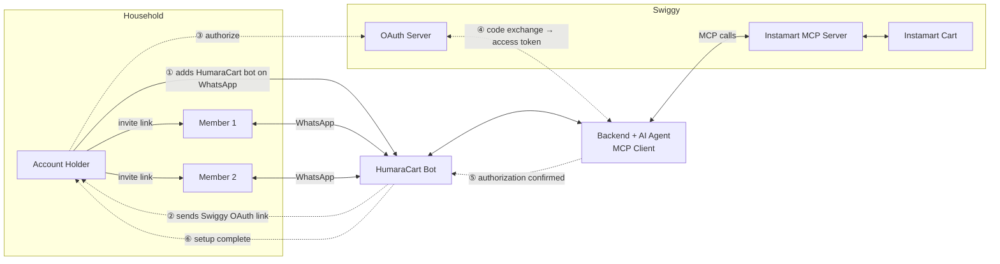

# HumaraCart: A Collaborative Household Instamart Assistant
### Swiggy Builders Club: Developer Program Application

---

## The Problem

In a shared household, everyone has needs but no one has full visibility. Person 1 orders milk not knowing Person 2 already ordered it. Person 3 forgets to tell anyone they used the last of the detergent. Items get duplicated, items get missed, and the coordination happens after the fact.

The problem is not Instamart. The problem is there is no shared layer, no single view of what the household needs. Each person is ordering in isolation.

---

## The Idea

Picture a WhatsApp group: three flatmates, one shared address. There is a fourth member in the group, HumaraCart, an AI assistant.

Throughout the day, as people notice things running low, they just say it:

- Priya: `add milk`
- Rahul: `add detergent`
- Sneha: `add chips`
- Rahul: `remove detergent`
- Sneha: `show list`
- HumaraCart: `Current list: milk, chips`

HumaraCart maintains a running cart for the household. No one has to remember. No one has to open Instamart. When the list feels ready, any member nudges the account holder. The account holder reviews, makes last minute changes, confirms, and the bot places the order — bill, payment, and all — right inside WhatsApp. That is it.

This is the vision.

---

## The Challenge

WhatsApp Business API does not natively support group bots. A bot cannot be added as a member of a WhatsApp group.

---

## The Workaround

Each household member has a 1:1 conversation with the bot. On the backend, all members are mapped to a shared household group ID. Every addition is reflected in one unified list. Members who opt in receive the updated list after every addition.

The user experience is identical to the group vision. The difference is only under the hood. This approach works fully within the official WhatsApp Business API. No unofficial libraries. No ToS risk.

---

## Why WhatsApp

WhatsApp is where Indian households already communicate. Any channel that requires a new app or a new habit creates drop-off before the product gets a chance. WhatsApp is not a technical convenience. It is where the user already is.

---

## System Overview

---

## How It Works

**Setup (done once by the account holder):**
- The account holder saves the HumaraCart number, initiates a chat, and links their existing Instamart account via OAuth. No new account needed.
- The bot generates a secure invite link. The account holder forwards this to other members.
- New members tap the link, WhatsApp opens, and the bot adds them to the household.
- The bot greets new members: *"Welcome to HumaraCart, powered by Swiggy Instamart. You have joined Priya's Household. Orders are fulfilled by Instamart via Priya's account. You do not need one."*
- During setup the bot shows the account holder their saved Instamart addresses and asks which to use for the household — every order delivers there. (Swiggy requires the user to pick the delivery address.)

**Day-to-day usage:**
- Any member messages the bot: `add milk`, `add detergent 2`, `add chips`, `remove milk`, `show list`
- If the size or brand isn't specified, the bot shows the matching options and the member picks — Swiggy requires confirming the exact variant before adding to cart, so this doubles as brand selection.
- The bot uses Swiggy's Instamart MCP tools to search items and build the shared cart on behalf of the household.

**Ordering:**
- Any member can nudge the account holder: `ready to order`. The bot forwards it: *"Priya thinks the cart is ready. Want to review?"*
- The account holder sends `checkout`. The bot shows the full bill (items, fees, total) and delivery address, and lists the available payment methods.
- The account holder confirms and picks a method. For **UPI**, the bot sends a payment link right in WhatsApp — one tap, pay in any UPI app, and the order is placed (it finalizes automatically once payment succeeds). **Cash on delivery** also works.
- The whole flow — cart, confirmation, payment, order — happens **inside WhatsApp**. No one opens Instamart. (The one exception: a cart over ₹1,000, where Swiggy requires checkout in the app.)
- Delivery updates are shared with all household members via the bot.

**Household management:**
- Members can be added or removed at any time.
- Switching households creates a new group ID on the backend. Before creation, the backend checks if a household with the same members already exists to avoid duplicates.
- Households are fully isolated. No cross-household visibility.

---

## Tech Stack

| Layer | Choice |
|-------|--------|
| Backend | Python, FastAPI |
| Agent | LangGraph (ReAct) — the agent does NL understanding **and** tool selection in one step; no separate intent-classification stage |
| LLM | OpenAI GPT-4o (via `ChatOpenAI`) |
| MCP Client | Swiggy Instamart MCP — real production `/im` (localhost prototyping needs no approval) |
| Swiggy APIs | TBD. Depends on what is available and exposed (e.g. order tracking) |
| Messaging | Twilio Sandbox for WhatsApp (V1); WhatsApp Business API (V2) |
| Database | SQLite (V1; Postgres later is a connection-URL change) |
| Cache / Observability | Deferred (Redis, LangSmith) — not needed for V1 |
| Infrastructure | Docker |
| Hosting | Local for V1 (laptop + ngrok or cloudflared tunnelling the Twilio webhook); DigitalOcean for V2+ |

The backend acts as the MCP client, receiving WhatsApp messages, resolving household context, and making Instamart MCP tool calls to search products and manage the shared cart.

---

## How We Plan to Use Swiggy Instamart MCP?

Our backend acts as the MCP Client. Every cart action is driven by Instamart MCP tool calls.

> **Note:** For a detailed step-by-step MCP tool call flow, see the sequence diagram [here](./SEQUENCE_DIAGRAM.md).

| Tool | Triggered When | What It Enables |
|------|---------------|-----------------|
| `search_products` | Member adds an item | Finds the right product on Instamart |
| `update_cart` | Item added or removed | Modifies the shared household cart |
| `get_cart` | After every cart change | Fetches current state to broadcast to all members |
| `get_payment_options` | Before checkout | Shows the account holder the available payment methods (UPI apps, QR, COD) |
| `checkout` | Account holder confirms the order | Places the order in-chat — for UPI, returns a payment link the holder taps to pay; the order finalizes on payment |
| `track_order` | After order is placed | Fetches live order status for broadcast |
| `get_orders` | V2: purchase patterns | Enables reorder reminders based on history |

> **Cart link — resolved:** the MCP exposes **no** shareable cart link — and it doesn't need one. The cart syncs to the account holder's Instamart, and the agent **places the order and takes payment right in WhatsApp** (a UPI payment link, or COD). No app hand-off.

---

## Security

**Invite system**
Invite links are signed with a short-lived JWT encoding the household ID and an expiry. Tokens are single-use and tamper-proof. Expired or reused tokens are rejected.

**Instamart OAuth**
The account holder links their Instamart account via OAuth. HumaraCart never handles credentials directly — it operates via an access token scoped to cart and order actions only.

**Household isolation**
All household data is scoped to a group ID on the backend. No member can access or influence another household's cart.

**Cart control stays with the account holder**
No order is ever placed without the account holder's **explicit confirmation** — the holder reviews the full bill and approves before the bot calls checkout. HumaraCart never handles or stores payment details; payment is completed through Swiggy.

**Member management**
The account holder can remove members at any time. Removed members lose access immediately.

---

## The Trust Arc

**V1: Collaborative Cart**
Agent builds the cart from household inputs. The account holder reviews, confirms, and the agent places the order — in WhatsApp. Trust is established.

**V2: Household Intelligence**
- Agent learns from order history and identifies purchase patterns. Reminds: *"You usually buy milk every 5 days. It has been 4 days. Want to add it?"*
- Nudges the account holder when the cart has been idle: *"You have 5 items in your cart. Ready to order?"*

**V3: Auto-Order (opt-in)**
Routine items can be set to auto-order for users who have explicitly granted the agent permission. Fully opt-in and item-specific.

Each stage earns the next. Trust is not assumed. It is built incrementally.

---

## Why This Matters for Swiggy

Most Instamart use cases optimise for the individual user. HumaraCart treats the **household as the unit**, which is how grocery shopping actually works in India.

- **Higher order value:** a cart built by 3-4 people is larger than a cart built by 1
- **Higher retention:** shared utility is stickier than individual utility; churning means letting your household down
- **Reduced browse friction:** users never open the app to search; the agent handles discovery via Swiggy's MCP tools
- **V3 auto-order:** routine household replenishment becomes a recurring GMV stream with zero active user effort

This is not a chatbot for Instamart. It is a new interface layer for how households shop.

---

*Built on Swiggy Instamart MCP | Contact: [mridubhatnagar](https://www.linkedin.com/in/mridu-bhatnagar-17703a92/)*

